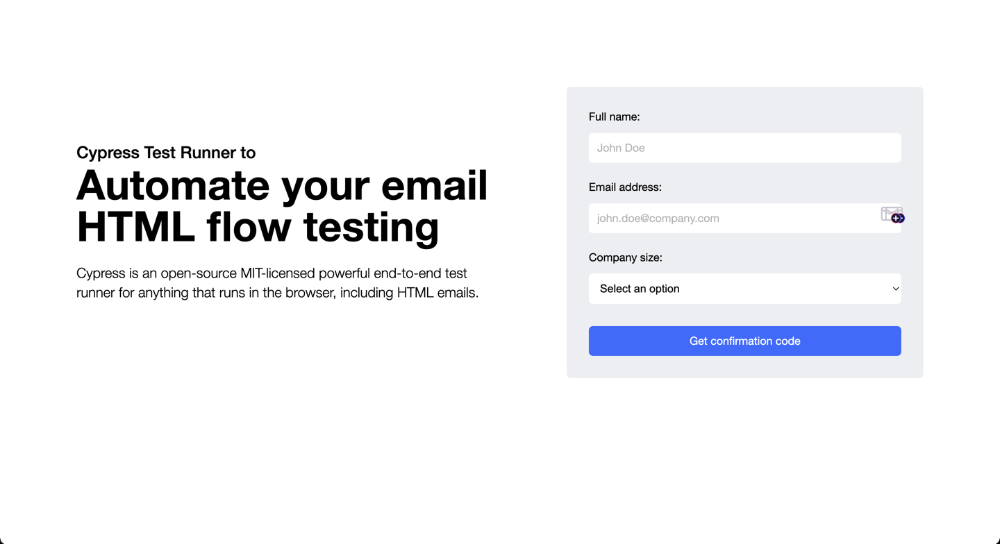
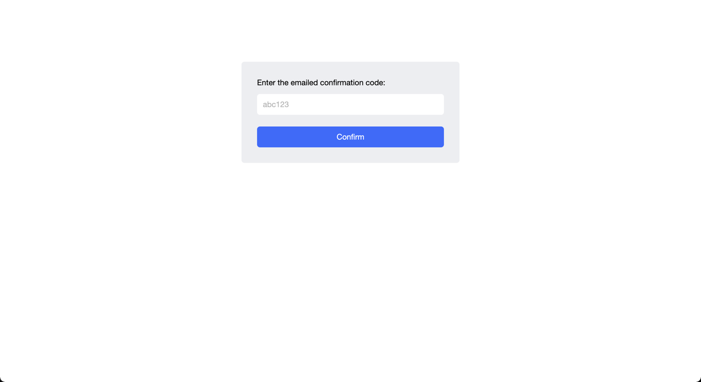

# codeception-email-testing-example
Example repository about testing emails with [codeception testing framework](https://codeception.com/).

Using [ProxiedMail php library](https://github.com/proxied-mail/proxiedmail-php-client) to perform email receiving and fetching confirmation code.

## Test Case

Test case is about requesting confirmation on a first page and validating the confirmation code from email on the second.
We have two pages:

1. Page that requests email confirmation

2. Page that validating confirmation code
   

## Code
You can check out the completed code in [EmailCodeCest](./tests/Acceptance/EmailCodeCest.php) 